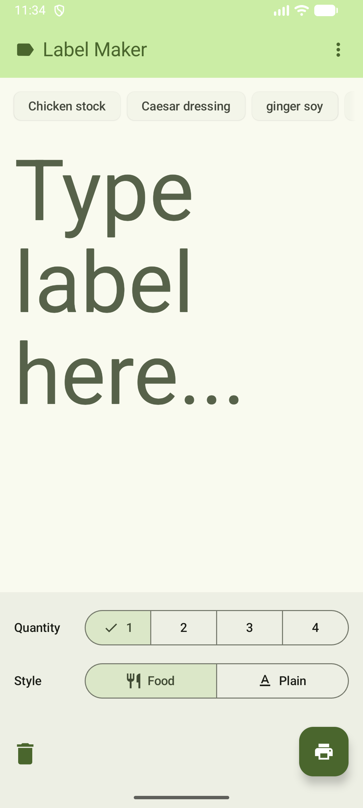

# Label Commander Android App

An Android application for managing and printing labels on the go. This app serves as a mobile client for the Label Commander ecosystem, communicating with the [Label Commander Server](https://github.com/heston/label-commander-server).



## Overview

Label Commander Android provides a convenient mobile interface to design and send print jobs to your label printer remotely via the Label Commander toolset.

## Related Projects

This app is part of the broader Label Commander ecosystem. Check out the other components:

* **[Label Commander Server](https://github.com/heston/label-commander-server)**: The backend API and server that processes requests and interfaces with the label printer.
* **[Label Commander (CLI)](https://github.com/heston/label-commander)**: The core command-line tool and library for generating and printing labels.

## Building

### GitHub Actions

This project uses GitHub Actions for continuous integration. APKs are automatically built in the cloud when new code is pushed or tagged. You can download the latest compiled APK directly from the [Releases](https://github.com/heston/label-commander-android/releases) page or from the artifacts of a successful GitHub Actions workflow run.

### Local Build

To build the project locally, clone the repository, open it in Android Studio, or run the standard Gradle build commands from the terminal:

```bash
cd LabelMaker
./gradlew assembleDebug
```
